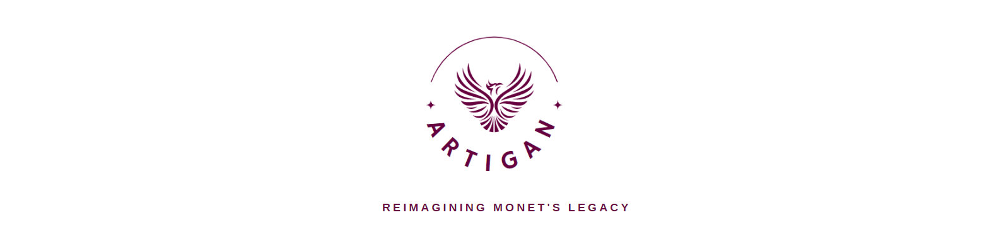

# ArtiGAN
Our Project generates Monet-style images using a Generative Adversarial Network (GAN) consisting of a generator and discriminator neural network. Also, It contains some additional features like Chatbot which tells you about what actually Monet-style images are, along with feature of Object Detection for generating its images using GAN architecture.
<a name="readme-top"></a>

<br />
<div align="center">
  <a href="#">
    
  </a>

<p align="center">
    <br />
    <a href="https://github.com/falselunatic/ArtiGAN"><strong>Explore the docs »</strong></a>
    <br />
    <br />
    <a href="https://github.com/falselunatic/ArtiGAN">View Demo</a>
    ·
    <a href="https://github.com/falselunatic/ArtiGAN/issues">Report Bug</a>
    ·
    <a href="https://github.com/falselunatic/ArtiGAN/issues">Request Feature</a>
  </p>
</div>

---


<!-- TABLE OF CONTENTS -->
<details>
  <summary>Table of Contents</summary>
  <ol>
    <li>
      <a href="#about-the-project">About The Project</a>
      <ul>
        <li><a href="#built-with">Built With</a></li>
      </ul>
    </li>
    <li>
      <a href="#getting-started">Getting Started</a>
      <ul>
        <li><a href="#prerequisites">Prerequisites</a></li>
        <li><a href="#installation">Installation</a></li>
      </ul>
    </li>
    <li><a href="#project-structure">Project Structure</a></li>
    <li><a href="#objectives">Objectives</a></li>
    <li><a href="#technologies-used">Technologies Used</a></li>
    <li><a href="#glimpses">Glimpses</a></li>
    <li><a href="#project-specifications">Project Specifications</a></li>
    <li><a href="#quantitative-results">Quantitative Results</a></li>
    <li><a href="#happy-coding">Happy Coding</a></li>
  </ol>
</details>

---

<!-- ABOUT THE PROJECT -->
## About The Project

The project aims to build a Generative Adversarial Network (GAN) that can generate a large number of Monet-style images. The problem statement is that there is a need for a large dataset of Monet-style images for research, training, or other purposes, but such a dataset does not currently exist.

The proposed solution is to use GANs, a type of machine learning algorithm, to generate Monet-style images that are visually similar to the famous impressionist painter Claude Monet's paintings. A GAN consists of two parts: a generator and a discriminator. The generator learns to create images that resemble the training data (in this case, Monet's paintings), while the discriminator learns to distinguish between the generated images and real images.

By training the GAN on a dataset of Monet's paintings, the generator can learn to produce new images that have similar style, color, and texture to the original paintings. The goal is to generate a large number of images, ranging from 7,000 to 10,000, that can be used for various purposes, such as art generation, image manipulation, or computer vision research.


<!-- about -->

<p align="right">(<a href="#readme-top">back to top</a>)</p>


### Built With

[](https://skillicons.dev)

### Dataset used 

<p>(<a href="https://www.kaggle.com/competitions/gan-getting-started">https://www.kaggle.com/competitions/gan-getting-started</a>)</p>

<p align="right">(<a href="#readme-top">back to top</a>)</p>


<!-- GETTING STARTED -->

## Getting Started

### Prerequisites

- Knowledge of python & its libraries.
- Basics of deep learning framework - PyTorch.
- Data visualisation tools.
- OpenCV.
- Google Colab.

### Installation

- Visual Studio Code
- Data Visualisation Tool (Matplotlib)

<p align="right">(<a href="#readme-top">back to top</a>)</p>

## Objectives

- [x] Develop a Generative Adversarial Network (GAN) architecture to generate Monet-style images.
- [x] Train the GAN using a high-quality dataset of Monet paintings to produce 7,000 to 10,000 generated images.
- [x] Evaluate the quality of the generated images using both quantitative and qualitative methods.
- [x] Compare the generated images with real Monet paintings to assess the realism and artistic merit of the GAN-generated images.
- [x] Experiment with different hyperparameters and training settings to improve the quality of the generated images.
- [x] Explore the potential applications of the GAN-generated images in art, design, and other fields.
- [x] Contribute to the research on GANs and generative art by proposing novel techniques and insights.
- [x] Provide a well-documented and reusable codebase for other researchers and practitioners to build upon.
- [ ] other objectives.

<p align="right">(<a href="#readme-top">back to top</a>)</p>

## Project Structure

```

├── ArtiGAN
│   ├── ARTIGAN.ipynb
│   ├── Chatbot
│       ├── main.py
│   ├── Camera Capture
│       ├── main.py
├── Images

```

<p align="right">(<a href="#readme-top">back to top</a>)</p>

## Technologies Used 

## In ArtiGAN -
- Python (Programming Language)
- Numpy (Python Libraries)
- PyTorch (Deep Learning Framework)
- OpenCV (Image Processing Tool)
- Matplotlib (Data Visualisation Tool)

<p align="right">(<a href="#readme-top">back to top</a>)</p>

## Glimpses


---


---


---


---


---

- Generated Images Getting Stored In Drive

https://user-images.githubusercontent.com/97685305/228123626-123ba127-573f-4dbe-a7d8-d0733c8f09ae.mp4

---

- Capturing Real-Time Images & Generating Their Monet Style Images

https://user-images.githubusercontent.com/97685305/228123835-b9292aa7-88a7-4b61-9b61-f2ed87498e4e.mp4

---


<p align="right">(<a href="#readme-top">back to top</a>)</p>


## Project Specifications

- Allows you to generate high-quality 7,000 to 10,000 monet-style images using GAN Architecture.
- Allows to evaluate the quality of the generated images using both quantitative and qualitative methods.
- Talk to bot feature, which is user-friendly.
- Objects detection feature.
- Provides a well-documented and reusable codebase for other researchers and practitioners to build upon.

<p align="right">(<a href="#readme-top">back to top</a>)</p>


## Quantitative-results

- <b> Fake score: 0.42 </b>
- <b> Real score: 0.91 </b>

<p align="right">(<a href="#readme-top">back to top</a>)</p>

## Check this for more info
<a href="https://www.canva.com/design/DAFeTp8wkRk/kqYb7S1daGAzYIB26KR95g/view?utm_content=DAFeTp8wkRk&utm_campaign=designshare&utm_medium=link&utm_source=publishsharelink">
  <i> Check the Presentation </i>
</a>
</br>

<a href="https://www.canva.com/design/DAFeIVzdPX8/JhyNz6ZdGcX7x37YeVu_zg/view?utm_content=DAFeIVzdPX8&utm_campaign=designshare&utm_medium=link&utm_source=publishsharelink">
  <i> Check the Project Report</i>
</a>
</br>

<a href="https://www.loom.com/share/ca245e62a9bf4b98860ab89580e5e77a">
  <i> Video Explanation of Chatbot</i>
</a>


## Happy Coding

[](https://forthebadge.com)
